# v2v-style-transfer

## Introduction

This is the code of the final course project for [CMU 10807](http://www.cs.cmu.edu/~rsalakhu/10807_2016/), **"Video Style Transfer Using Convolutional Neural Networks"**, from [Zhuyun Dai](http://www.cs.cmu.edu/~zhuyund/), [Fuchen Liu](http://www.stat.cmu.edu/people/students/fuchenl) and [Lingxue Zhu](https://lingxuez.github.io/).

This project builds on several algorithms for image-to-image artistic style transfer, including [A Neural Algorithm of Artistic Style](https://arxiv.org/abs/1508.06576) by Leon A. Gatys, Alexander S. Ecker, and Matthias Bethge, as well as [Perceptual Losses for Real-Time Style Transfer and Super-Resolution](http://cs.stanford.edu/people/jcjohns/eccv16/) by Justin Johnson, Alexandre Alahi and Li Fei-Fei. Some of the codes in this repository are forked from [jcjohnson/neural-style](https://github.com/jcjohnson/neural-style). After combining these algorithms with video style-extraction approaches and post-smoothing techniques, our method is able to perform **video-to-video style transfer**.

The following example illustrates how we can transfer the styles from three different movie trailers to a self-recorded video. The trailers shown below are from [Life of Pi](https://en.wikipedia.org/wiki/Life_of_Pi_(film)) (left), 
[Big Fish \& Begnonia](https://en.wikipedia.org/wiki/Big_Fish_%26_Begonia) (middle),
and [5 Centimeters Per Second](https://en.wikipedia.org/wiki/5_Centimeters_Per_Second) (right). For illustration, we only select 10 seconds from the original trailer for style transfer.

 
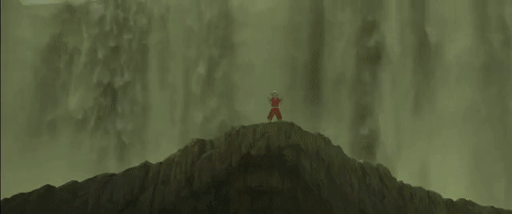 
 

Our approach first finds the key frames from each trailer, and applies the image-to-image style transfer algorithm to synthesize the target video. The style of a video is a subject definition which can have many interpretation. Here, we provide two ways to extract the style of a video:

- Merged style: in this scenario, we merge all styles in the keyframes and treat the blended version as a representation of the entire video. The following gif shows the results of (i) the original self-recorded video, (ii) the stylized video from *Life of Pi*, (iii) the stylized video from *Big Fish \& Begnonia*, and (iv) the stylized video from *5 Centimeters Per Second*.

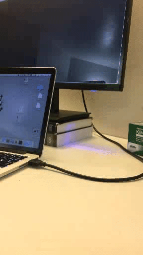 
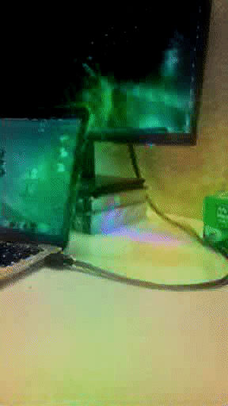 
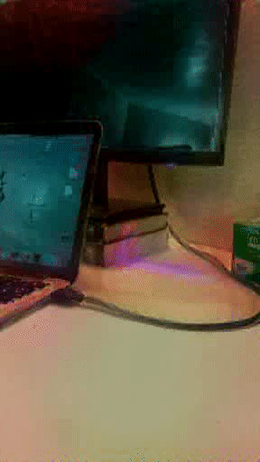 
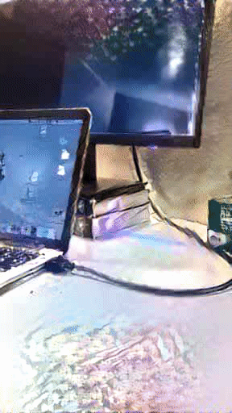 


- Transitioning style: in this scenario, we focus on the temporal transitioning of the styles in the trailer, and the final video maintains such transitioning. The following gif shows the results of (i) the original self-recorded video, (ii) the stylized video from *Life of Pi*, (iii) the stylized video from *Big Fish \& Begnonia*, and (iv) the stylized video from *5 Centimeters Per Second*.

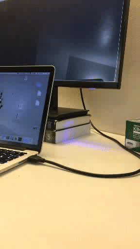 
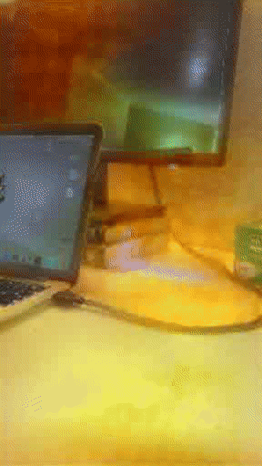 
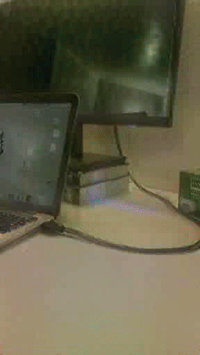 
 


## Key frames

We use [ffmpeg](https://ffmpeg.org/) to extract keyframes from the video. It efficiently captures the frames where a significant style swith occurs. The following images present the 8 keyframes extracted from the trailer of *5 Centimeters Per Second*:

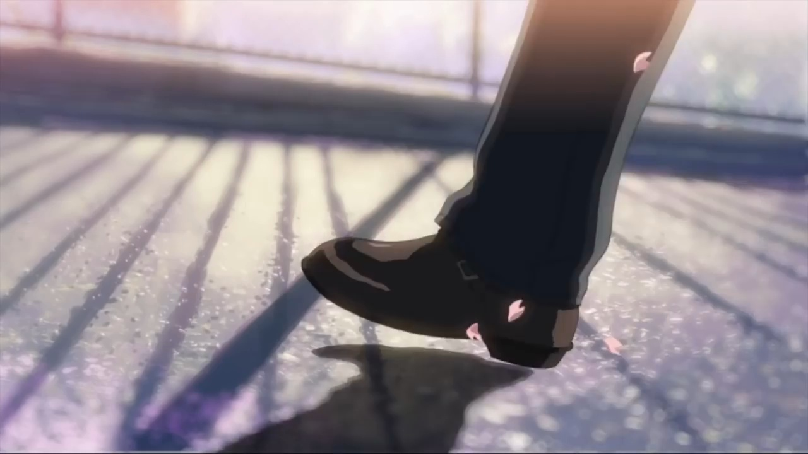 
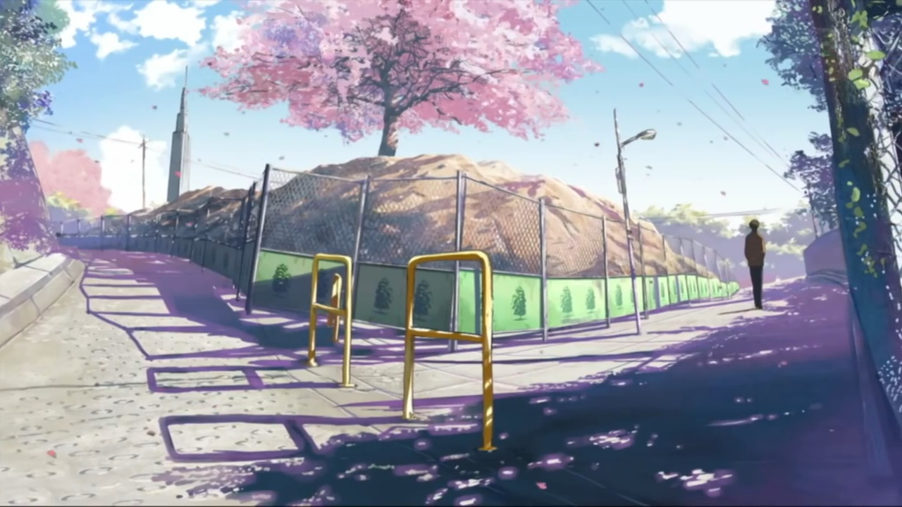 
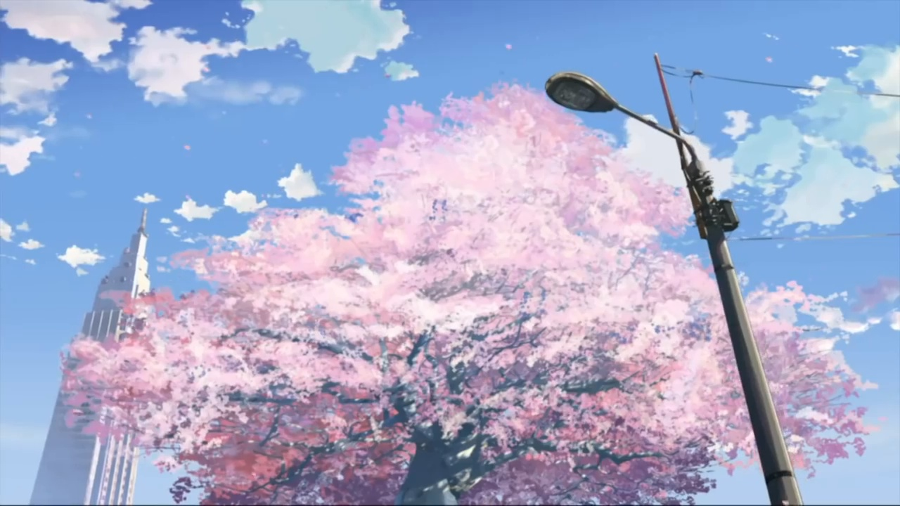 
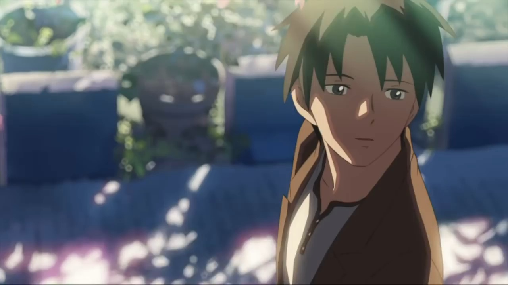 

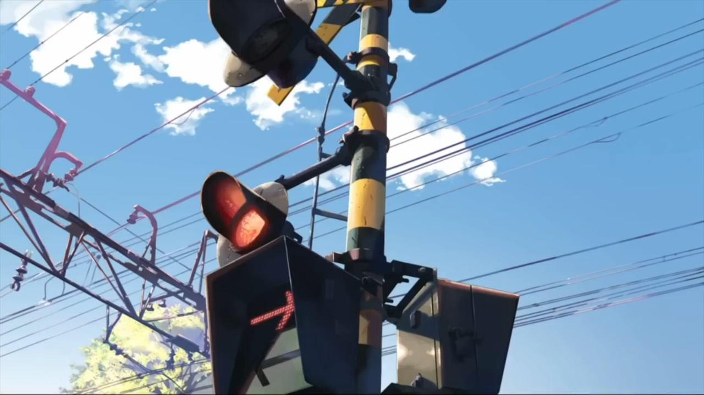 
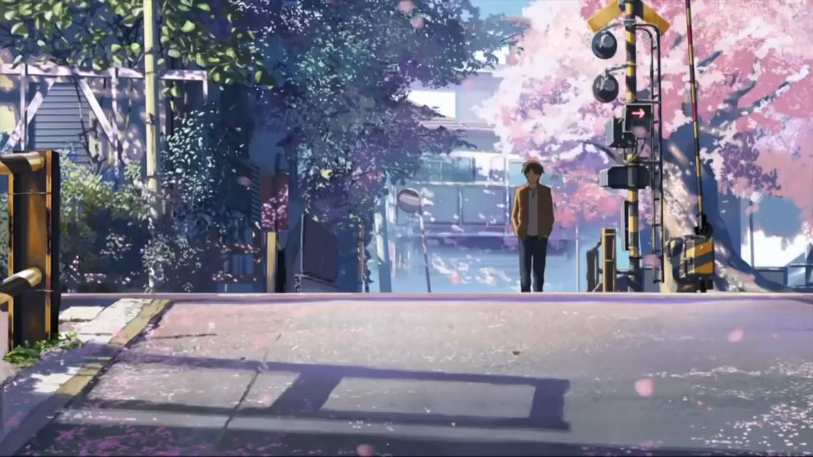 
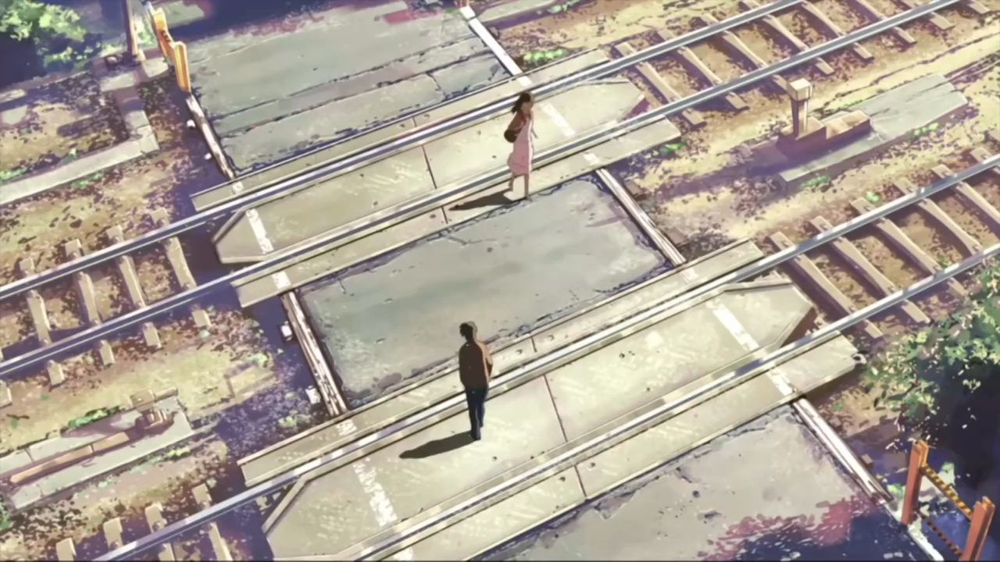 
 

This repository provides the keyframes from the 3 movie trailers in the illustrative example. They can be found under `trailer/*/frames_*`. You can also extract keyframes from your favorite movie trailer using the provided pre-processing code
```
cd trailers
sh pre-process.sh
```
Note that you will need to modify the path to your own video and output directory in the shell script.


## Setup

Dependencies:
* [torch7](https://github.com/torch/torch7)
* [loadcaffe](https://github.com/szagoruyko/loadcaffe)

After installing dependencies, you'll need to run the following script to download the VGG model:
```
sh neural-style/models/download_models.sh
```
This will download the original [VGG-19 model](https://gist.github.com/ksimonyan/3785162f95cd2d5fee77#file-readme-md).
For more details on the model and other optional dependencies, please refer to the repository [jcjohnson/neural-style](https://github.com/jcjohnson/neural-style). 


## Usage
After extracting several keyframes from the style video, run
```
cd neural-style
python v2v_style_transfer.py -i <input_dir> -s <style_dir> -o <output_dir>
```
Note that paths to images should not contain the `~` character to represent your home directory; you should instead use a relative path or a full absolute path.

For example:
```
cd neural-style
python v2v_style_transfer.py -i ../data/pig/frames \
-s ../trailer/bigfish/frames_bigfish -o ../data/pig/bigfish_frames
```

**Options**:
* `-i`: Path to the input directory containing `.jpg` frames of the source video.
* `-s`: Path to the style directory containing multiple `.jpg` style images. These are usually the keyframes of the style video (e.g. a movie trailer).
* `-o`: Path to the output directory, which will contain the output of stylized `.jpg` frames.
* `-method`: Either `"avg"` (uses average style representing the whole trailer) or `"sw"` (uses sliding window for style transitioning). Default is `"sw"`.
* `-window`: Length of sliding window of styles to use if `method="sw"`. Default is 2. 
* `-gpu`: Zero-indexed ID of the GPU to use; for CPU mode set `-gpu` to -1. Default is 0.
* `-niter`: Number of iterations. Default is 1000.


